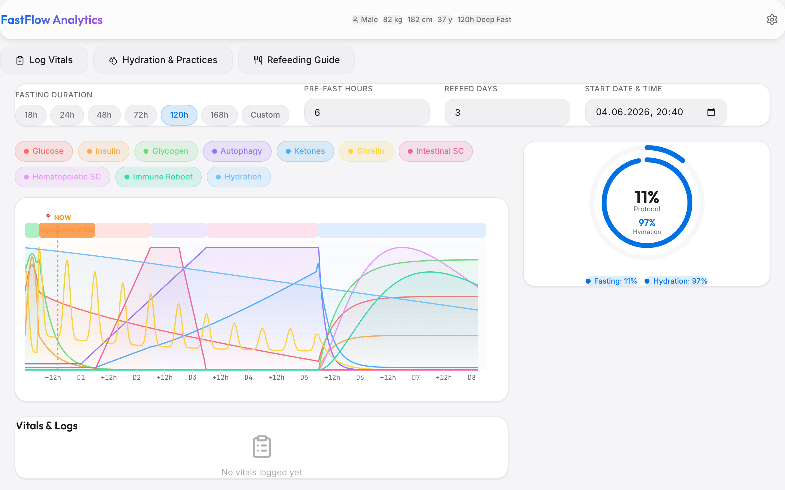

# FastFlow Analytics 🧬

[](LICENSE) [](https://github.com/leopardcodeai) [](https://nodejs.org)

> A premium, modern Metabolic & Fasting Analytics Dashboard built with React, Vite, TailwindCSS v4, and Recharts, designed following Apple's sleek hardware and software design language.



## 🌐 Live Application
Access the production deployment here: **[https://piratefastenapp.vercel.app](https://piratefastenapp.vercel.app)**

---

## ✨ Key Features

- **Apple Design Language**: Clean lines, Outfit headings, Inter body text, spacious inputs (44px height, `rounded-xl`), smooth transitions, and standard glassmorphism elements.
- **Dynamic Theming**: True Light Mode default with full support for Dark Mode and System Theme synchronicity (using media query listeners).
- **concentric SVG Progress Gauges**: 
  - **Outer Ring**: Real-time completion progress of the selected fasting protocol.
  - **Inner Ring**: Hydration levels based on Watson's Total Body Water (TBW) equation, changing color dynamically: Blue (≥70%), Yellow (45-70%), and Red (<45%).
- **Interactive Biomarker Curves**: Custom Recharts visualization plotting 9 biological parameters + Hydration. Features an active segmented phase tracker bar at the top, a "📍 NOW" vertical tracker, and a custom tooltip reporting raw un-normalized values (mg/dL, mmol/L, fold-increase, etc.).
- **Dehydration Alert Banner**: A pulsing warning card triggering when simulated hydration drops below 50%.
- **Modular Vitals Logging**: Form modal to log daily vitals (Glucose, Ketones, Weight, Sleep, Energy) with checkbox arrays for electrolytes and symptoms, automatically computing GKI (Glucose-Ketone Index) ranges.
- **Yoga & Hydration Practices**: Tabbed checks to log water intake (+250ml / +500ml quick-adds showing remaining TBW target) alongside a status-toggled checklist for Shankhaprakshalana rounds.
- **Structured Refeeding Guide**: Interactive timeline highlighting the current hour's nutritional status (Broth Only → Soft Foods → Light Proteins → Normal Foods).

---

## 🧬 Physiological Mathematical Engine

The dashboard is driven by a 3-phase mathematical engine (Pre-Fast, Fasting, Refeeding) that calculates realistic metabolic curves depending on the user's biological profile (gender, weight, height, age, and body composition):

### 1. Biomarkers Trajectories
1. **Glucose (mg/dL)**: Simulates meal spike in Pre-Fast, falls to standard baseline in Fasting via a power curve (`95 - 40 * (h/F)^0.7`, min 50), and recovers cleanly during Refeeding.
2. **Insulin (uIU/mL)**: Meal response followed by exponential decay during Fasting (`1.0 + 11.0 * exp(-h/8)`), recovering post-fast.
3. **Glycogen (%)**: Rapid glycogen burn (`90 * exp(-h/6)`), depleting to ~0% within 24 hours of fasting.
4. **Autophagy (%)**: Initiates at baseline 5%, rises linearly from 18h to 72h to peak cellular cleanup at 100%, decaying exponentially when refeeding.
5. **Ketones (mmol/L)**: Baseline 0.3, rising slowly from 24h to 48h, then accelerating exponentially beyond 48h to peak therapeutic ranges (4.5+ mmol/L).
6. **Ghrelin (%)**: Standard circadian hunger index waves (surging at day boundaries) that progressively decline in height after Day 3.
7. **Stem Cells (Fold Increase)**:
   - **Intestinal**: Rises from 1x to 10x between 24h and 48h of fasting, plateaus until 60h, and returns to baseline.
   - **Hematopoietic**: Surges uniquely during Refeeding, peaking at 10x at hour 36.
8. **Immune Reboot (%)**: Regenerates immune response exclusively during Refeeding, peaking at 80% at hour 48.

### 2. Watson Hydration Model
- **TBW Calculation**: 
  - *Male*: `2.447 - (0.09156 * age) + (0.1074 * height) + (0.3362 * weight)`
  - *Female*: `-2.097 + (0.1069 * height) + (0.2466 * weight)`
- **Water Target**: Derived as `weight * 0.035` (Athletic ×1.1, Female ×0.9).
- **Natriuresis Decay**: Simulates daily water loss (5% of TBW) multiplied by a fasting natriuresis coefficient (decay accelerates by up to +30% as fasting hours increase).

---

## 🛠️ Tech Stack & Architecture

- **Core**: React 19, TypeScript 6, Vite 8, TailwindCSS v4
- **Charts**: Recharts 3.8
- **Icons**: Lucide React 1.17
- **Linting**: ESLint (strictly warning-free)
- **Architecture**:
  ```
  src/
  ├── components/          # Render Components
  │   ├── ui/              # Reusable UI Primitives (Modal, Drawer, SegmentedControl)
  │   ├── Header.tsx
  │   ├── QuickConfigPanel.tsx
  │   ├── BiomarkerChart.tsx
  │   ├── ProgressRings.tsx
  │   └── VitalsTable.tsx
  ├── context/             # AppContext (central state provider)
  ├── data/                # Decoupled Math Models
  │   ├── biomarkerModel.ts
  │   ├── fastingModel.ts
  │   └── hydrationModel.ts
  ├── App.tsx              # Slim Orchestrator
  ├── index.css            # Design System Variables & Base Classes
  └── main.tsx             # Bootstrap Entry
  ```

---

## 🚀 Getting Started

### Prerequisites
Make sure you have Node.js (v18+) installed.

### Installation
1. Clone the repository:
   ```bash
   git clone https://github.com/leopardcodeai/fastenapp.git
   cd fastenapp
   ```
2. Install dependencies:
   ```bash
   npm install
   ```
3. Launch the local development server:
   ```bash
   npm run dev
   ```
   Open **[http://localhost:5173](http://localhost:5173)** in your browser.

### Building for Production
To build the static production bundle:
```bash
npm run build
```
The compiled output will be generated inside the `/dist` directory.
